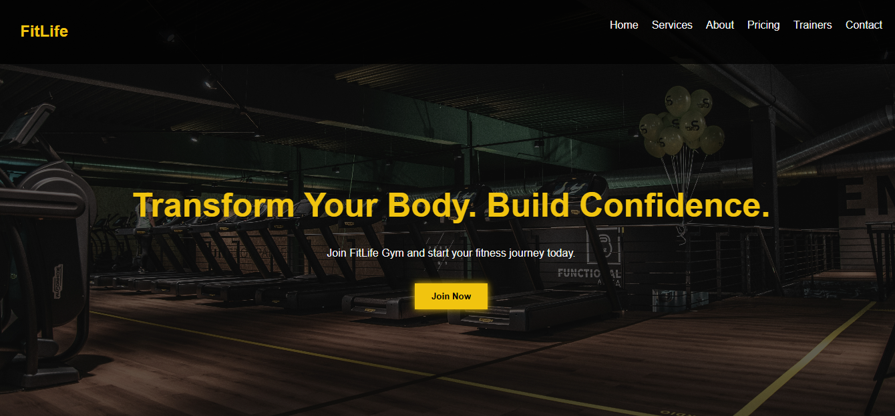
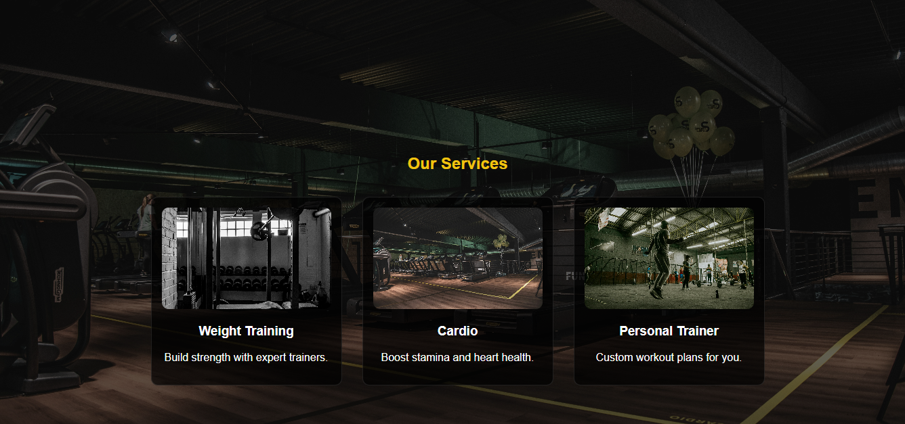
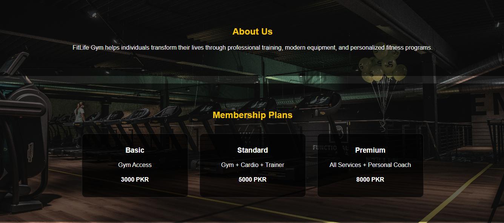
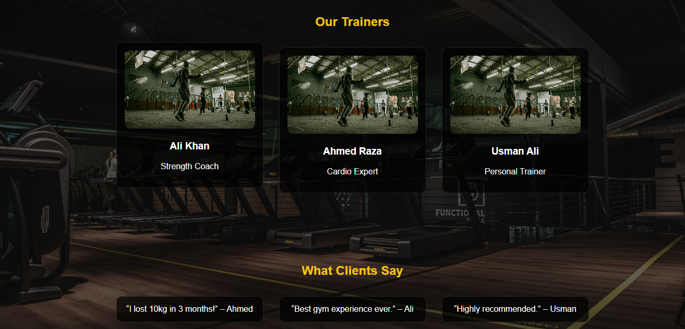
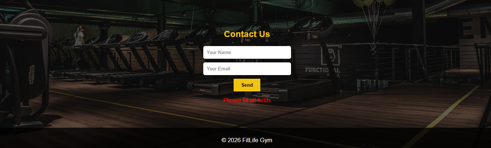

# FitLife Gym Website

A modern, responsive gym website built using HTML, CSS, and JavaScript.  
This project demonstrates a clean UI, business-focused layout, and responsive design suitable for real clients.

## Live Demo
https://neuroforgeweb.netlify.app

## Features
- Responsive design (mobile-friendly)
- Clean and modern dark UI
- Smooth scrolling navigation
- Services, About, Pricing, and Trainers sections
- Contact form validation
- Organized and readable code structure

## Technologies Used
- HTML5
- CSS3
- JavaScript

## Preview

## Project Purpose
This project showcases my ability to build professional, responsive websites for businesses such as gyms, fitness centers, and local services.

## Author
Frontend Developer – Available for freelance work

## Contact
Feel free to reach out for web development projects or improvements.
