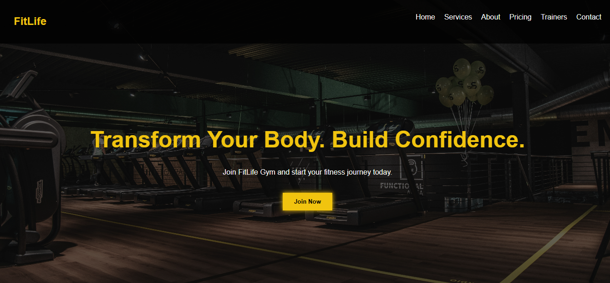
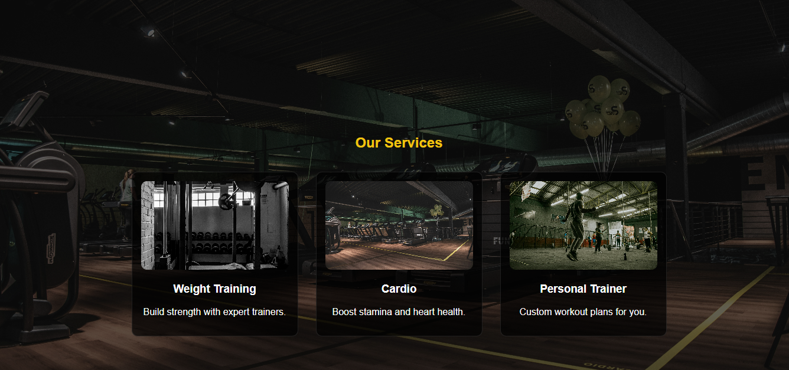
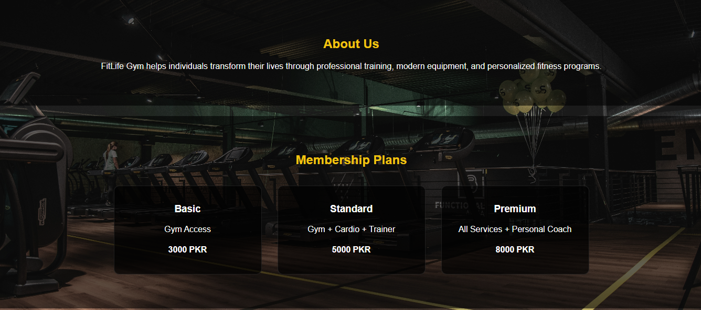
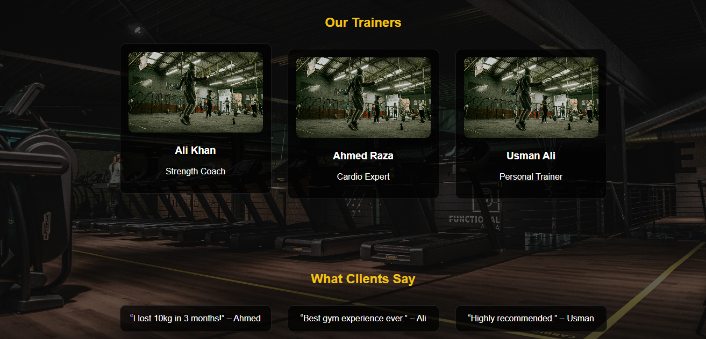
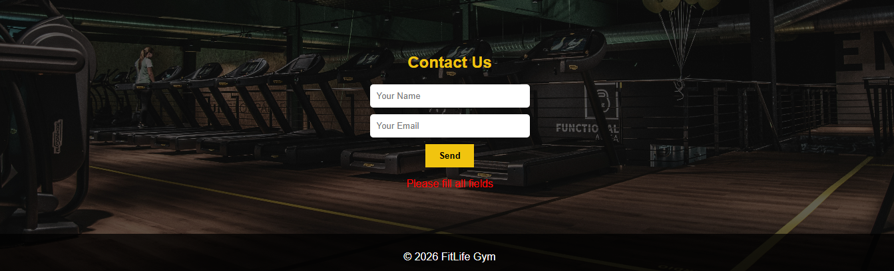

# FitLife Gym Website

A responsive frontend concept for a gym or fitness business, built with HTML, CSS, and vanilla JavaScript.

## Live Demo

https://neuroforgeweb.netlify.app

## Implemented Features

- Responsive layout for mobile and desktop
- Dark fitness-focused interface
- Navigation to Services, About, Pricing, Trainers, and Contact sections
- Client-side contact-form validation
- Smooth scrolling to the contact section

> The contact form is a frontend demonstration. It validates the name and email fields but does not send or store submissions.

## Technologies

- HTML5
- CSS3
- JavaScript

## Screenshots







## Run Locally

```bash
git clone https://github.com/khubaibrazi/fitlife-gym.git
cd fitlife-gym
```

Open `index.html` in a browser.

## Author

Khubaib Razi
