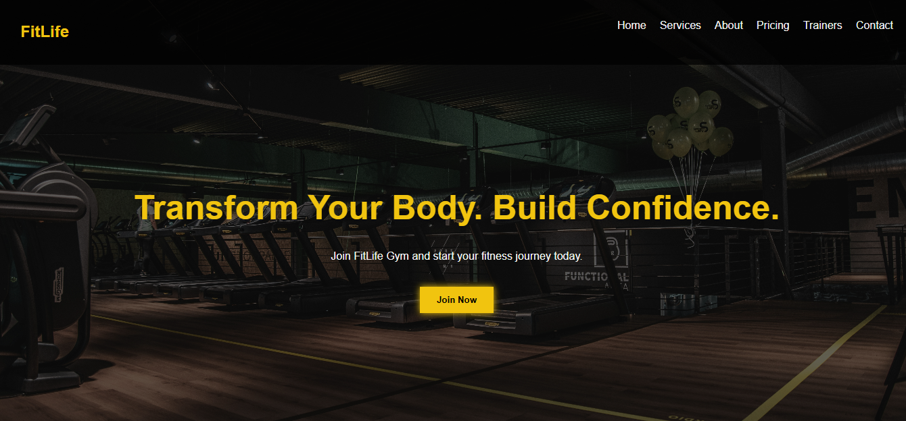
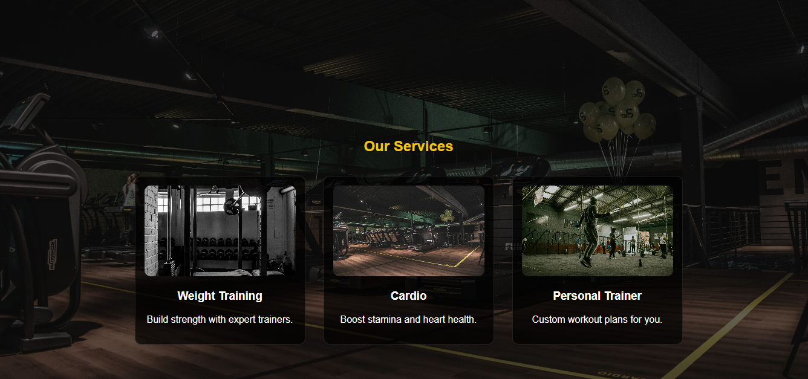
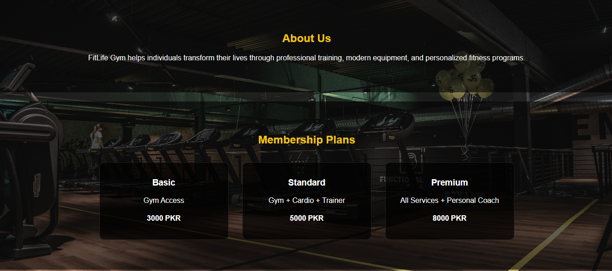
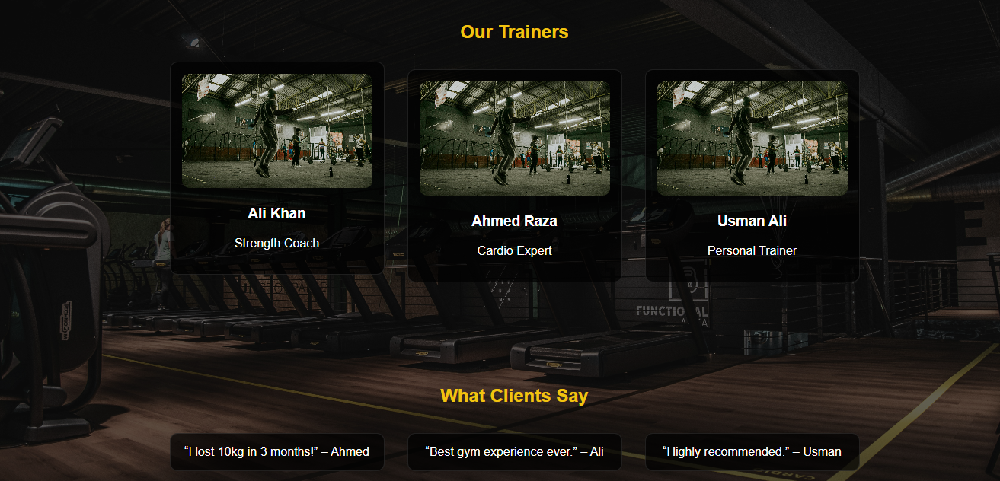
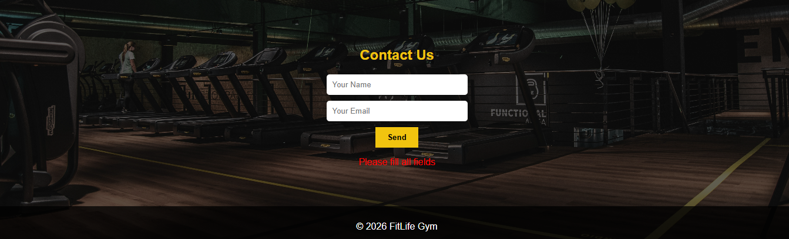

# FitLife Gym

A responsive frontend concept for a modern gym and fitness business, built with HTML, CSS, and vanilla JavaScript.

## Live Demo

https://neuroforgeweb.netlify.app

## Overview

FitLife was created as a complete landing-page experience for a fitness brand. The project focuses on clear visual hierarchy, responsive layouts, structured service presentation, and a simple contact experience.

## Implemented Features

- Responsive desktop and mobile layout
- Fitness-focused dark interface
- Hero and call-to-action sections
- Services presentation
- About section
- Pricing plans
- Trainer showcase
- Contact section
- Client-side contact-form validation
- Smooth in-page navigation

> The contact form is a frontend demonstration. It validates user input but does not send or store submissions.

## Technology

- HTML5
- CSS3
- JavaScript

## Screenshots







## Run Locally

```bash
git clone https://github.com/khubaibrazi/fitlife-gym.git
cd fitlife-gym
```

Open `index.html` in your browser.

## What This Project Demonstrates

- Responsive frontend development
- Visual hierarchy and layout composition
- Form validation with JavaScript
- Building a complete marketing-style website without a framework

## Author

**Khubaib Razi**

- GitHub: https://github.com/khubaibrazi
